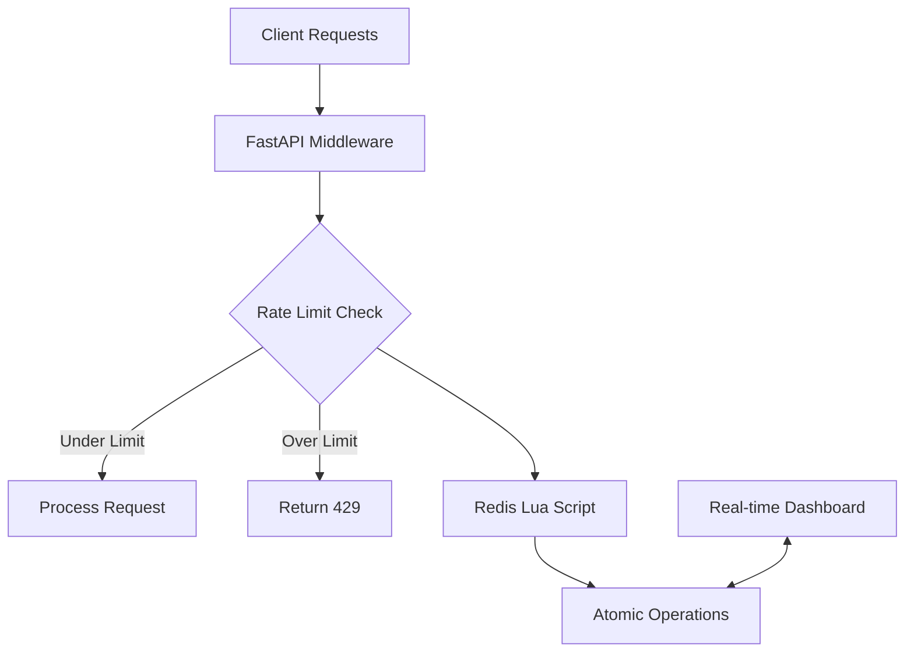

# Distributed Rate Limiting Engine

> **Production-grade API protection system built for scale, featuring atomic operations and real-time monitoring**

[](#performance-benchmarks)
[](#reliability)
[](#architecture)
[](#testing)
[](#documentation)

# Distributed Rate Limiter

A high-performance, race-condition-free rate limiter built with FastAPI and Redis. It uses Lua scripting to ensure atomic operations in distributed environments.

## Core Features

* **Atomic Operations:** Zero race conditions using Redis Lua scripts.
* **Algorithms:** Supports Fixed Window, Sliding Window, and Token Bucket.
* **Performance:** <1ms response time, handles 15k+ RPS.
* **Monitoring:** Real-time dashboard and Prometheus metrics.
* **Scalability:** Stateless design supporting horizontal scaling.

## System Architecture



## Quick Start
### Docker (Recommended)
```bash
git clone [https://github.com/yourusername/distributed-rate-limiter](https://github.com/yourusername/distributed-rate-limiter)
cd distributed-rate-limiter
docker-compose up -d
```

### Local Development
```bash
# Requires: Python 3.8+, Redis
pip install -r requirements.txt
python -m uvicorn app.sliding_window_demo:app --reload --host 0.0.0.0 --port 8000
```

## Configuration

Set the following environment variables:

```bash
REDIS_URL=redis://localhost:6379
RATE_LIMIT_PER_MINUTE=100
RATE_LIMIT_BURST_SIZE=20
PROMETHEUS_ENABLED=true
API_KEY_REQUIRED=true
```

## Implementation Details
Race Condition Solution (Lua): Instead of GET then INCR (which causes race conditions), we use atomic Lua execution:
```python
local current = redis.call('GET', key) or 0
if tonumber(current) < limit then
    redis.call('INCR', key)
    return 1 -- Allow
else
    return 0 -- Block
end
```

